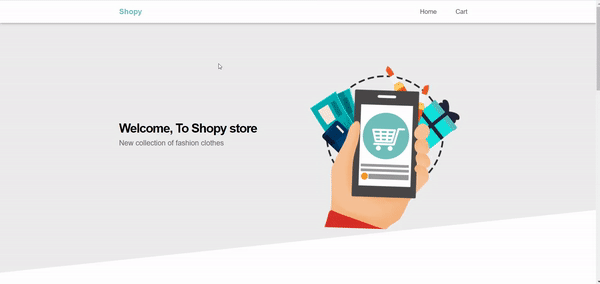

# Shopy Project Overview

Shopy is Angular application that allows users to view a list of available products to purchase, add them to a shopping cart, click like button to add it in features, and ultimately complete the checkout process.

## Project Instructions

#### Project introduction: shopy

A single-page application to e-commerce website .

 

#### Project features

This application reflects the same user experience as that of a real-world e-commerce website, including a(n):

* **Home** page, which displays Product List that the available products for the user to choose and add to their cart (in various quantities), also the features products
* **Product details** page, which displays more information about any particular product
* **Shopping cart**, which includes the products that the user has added to their cart
* **Checkout form**, which collects information about the user (e.g., name, address, phone ,payment details)
* **Order confirmation page**, which shows the outcome after the user completes the checkout process (i.e., submits the checkout form)
